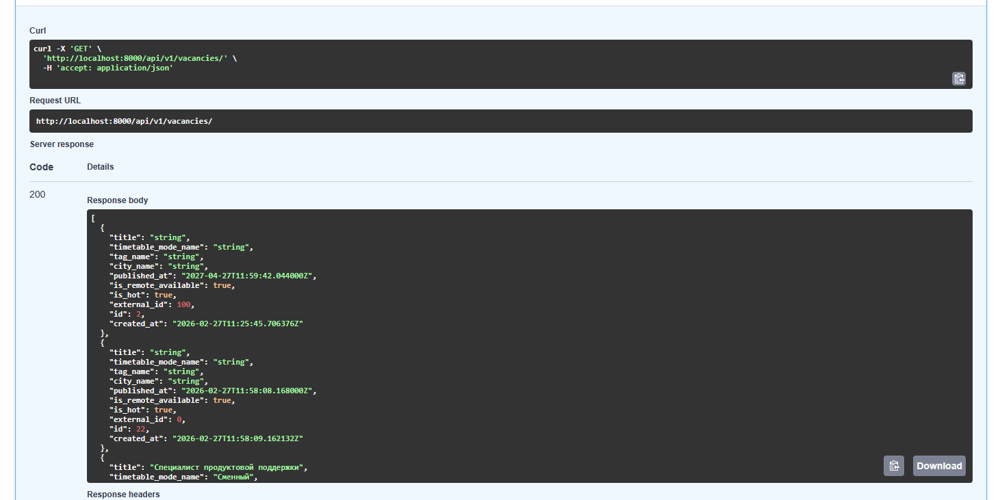
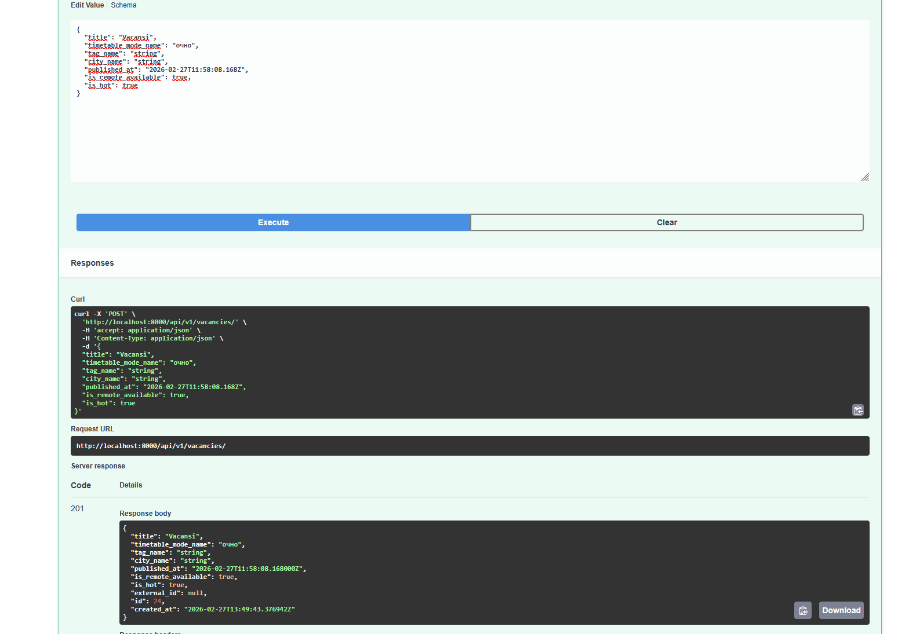
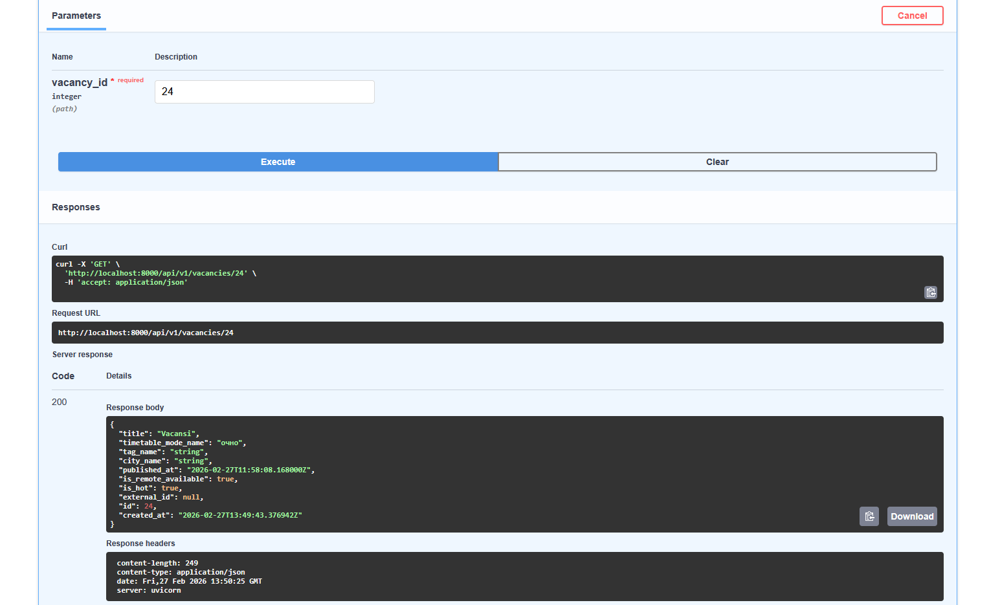
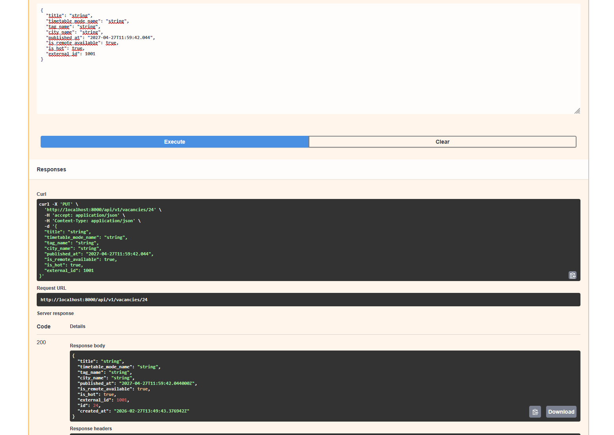
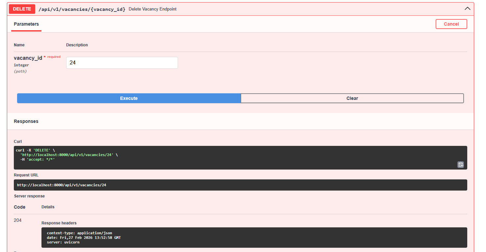
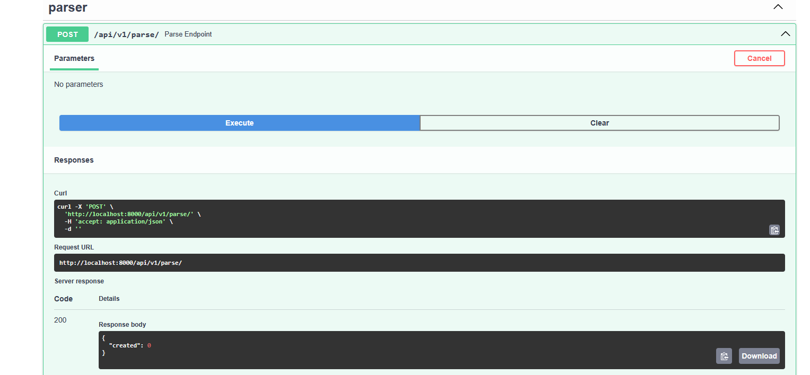
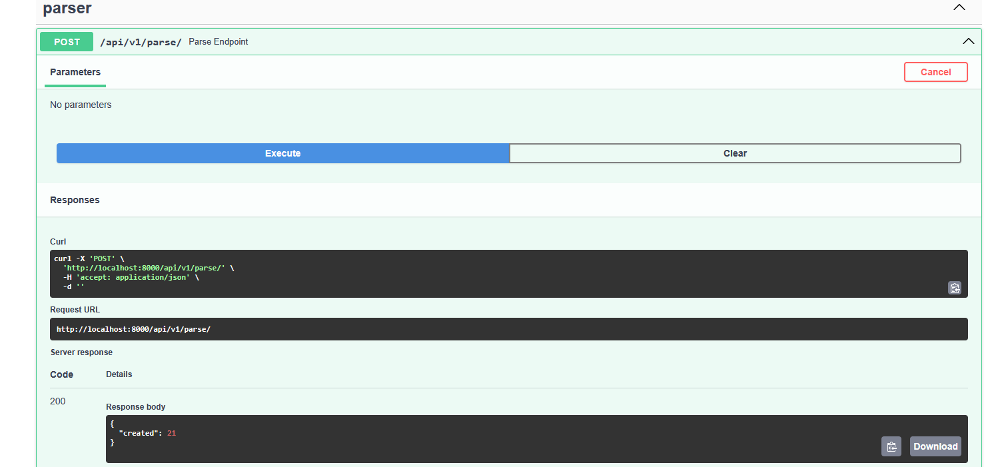

# Отчет

## 1. Шаг 1: Анализ и запуск

* **Что сделал:**
  Запустил `docker-compose up`, получил ошибку

  ```
  Extra inputs are not permitted [type=extra_forbidden, input_value='postgresql+asyncpg://pos...stgres@db:5432/postgres', input_type=str]
  ```

* **Проблема:**
  Контейнер не стартует из-за дополнительных полей при парсинге конфига (тк мы два раза его используем в docker-compose и в самом Docker образе, когда копируем)

* **Решение:**
  Добавил в парсинг конфига `extra="ignore"`. Также исправил алиас на `"DATABASE_URL"`

* **Что сделал:**
  Снова попытался запустить

* **Проблема:**
  Приложение выдает ошибку

  ```
  /usr/local/lib/python3.11/site-packages/uvicorn/lifespan/on.py:91: RuntimeWarning: coroutine '_run_parse_job' was never awaited
  ```

* **Решение:**
  `_scheduler = create_scheduler(_run_parse_job)` — не нужно вызывать `await _run_parse_job`, тк это запустит парсер и остановит весь event loop. Нужно передавать его в планировщик.

* **Дополнительно:**
  Исправил копирование в Dockerfile (итак копирует в WORKDIR):

  ```dockerfile
  COPY requirements.txt .
  COPY . .
  ```

---

## 2. Шаг 2: Исправление багов парсера

* **Что сделал:**
  Запустил планировщик парсера

* **Проблема:**
  Парсер запускается каждые 5 сек вместо положенных 5 минут

* **Решение:**
  Поменял `seconds` на `settings.parse_schedule_minutes * 60`

* **Что сделал:**
  Запустил еще раз планировщик парсера

* **Проблема:**
  ```python
  "city_name": item.city.name.strip(),
                   ^^^^^^^^^^^^^^
  AttributeError: 'NoneType' object has no attribute 'name'
  ```

* **Решение:**
  Добавил проверку опционального поля:

  ```python
  "city_name": item.city.name.strip() if item.city else None
  ```
---

## 3. Шаг 3: Исправление багов API

* **Что сделал:**
  Запустил ручку `POST /api/v1/vacancies/{vacancy_id}` с `external_id`, который уже существует

* **Проблема:**
  Сервер отдает статус 200, при этом возвращается ошибка

* **Решение:**
  Поменял `JSONResponse` на `HTTPException` и установил статус `status.HTTP_409_CONFLICT`

* **Что сделал:**
  Запустил ручку `PUT /api/v1/vacancies/{vacancy_id}` с `external_id`, который уже существует

* **Проблема:**
  Сервер отдает 500 ошибку

* **Решение:**
  Добавил проверку на уникальность `external_id`
---

## 4. Шаг 4: Дополнительные исправления кода и оптимизация

* Добавил GIN индексы для полей `timetable_mode_name` и `city` используя библиотеку `gin_trgm_ops` для ускорения поиска по `ILIKE %...%`

* Оптимизировал в `upsert_external_vacancies` получение вакансий (все данные с существующими `external_id` получаю одним запросом и записываю в словарь)

* Вместо `app.on_startup` / `app.on_shutdown` использовал `lifespan`

* Добавил в `docker-compose` volumes:
  ```
  - ./app:/app/app
  ```
  и флаг `--reload` на время тестов приложения

* Исправил тип у поля в конфиге `log_level`:
  ```python
  log_level: Literal["INFO", "DEBUG"]
  ```
  для прозрачности


## 5. Итог

* Все эндпоинты работают корректно.

*  Приложение возвращает корректные HTTP-статусы и данные.

*  Приложен скриншот Swagger UI с выполненными успешными запросами.

## Cкриншоты:
Успешное получения вакансий

Успешное создание новой вакансии без external_id

Успешное получение вакансии по id

Успешное изменения вакании по id

Успешное удаление вакансии по id

Успешное парсинг (когда бд заполнена)

Успешное парсинг (когда бд пустая)
